# Grade Validation Database ERD

이 문서는 Flyway 마이그레이션 `V1`~`V37`을 기준으로 작성한 현재 MySQL 물리 스키마 ERD다.

- 전체 테이블: 22개
- 관계 표기: 실제 외래 키 제약조건 기준
- `PK`: 기본 키, `FK`: 외래 키, `UK`: 유일 키
- 컬럼 설명의 `nullable`은 `NULL` 허용 컬럼을 뜻한다.
- `evaluation_rule`의 `admission_type`, `recruitment_unit`은 규칙 버전 보존을 위한 문자열 스냅샷이며, 입학 카탈로그 테이블과 직접 외래 키로 연결되지 않는다.

## 도메인별 테이블

| 도메인 | 테이블 | 역할 |
|---|---|---|
| 대학 | `university` | 대학 기본정보와 사용 여부 |
| 입학 카탈로그 | `admission_track` | 대학·입학연도별 전형 |
| 입학 카탈로그 | `recruitment_unit` | 전형별 모집단위 |
| 지원 | `student_application` | 지원자와 모집단위의 연결 |
| 지원자 | `student` | 지원자 기본정보와 학력 유형 |
| 학생부 | `student_transcript_course` | 과목별 성적과 이수단위 |
| 학생부 | `student_attendance` | 학년별 미인정 출결 |
| 학생부 | `student_school_violence_action` | 학교폭력 조치 내역 |
| 구교육과정 | `student_legacy_grade_summary` | 학기·학년별 석차 요약 |
| 검정고시 | `student_ged_subject_score` | 검정고시 과목별 원점수 |
| 가져오기 | `student_transcript_import` | 학생부 파일 가져오기 작업 이력 |
| 가져오기 | `student_transcript_import_course` | 가져오기 작업별 과목 성적 불변 스냅샷 |
| 평가 규칙 | `evaluation_rule` | 대학별 성적 반영 규칙과 버전·생명주기 |
| 평가 규칙 | `evaluation_rule_grade_score` | 석차등급별 환산점수 |
| 평가 규칙 | `evaluation_rule_achievement_grade` | 성취도별 환산등급 |
| 평가 규칙 | `evaluation_rule_achievement_score` | 성취도별 환산점수 |
| 평가 규칙 | `evaluation_rule_legacy_achievement_grade` | 구교육과정 평어별 환산등급 |
| 평가 규칙 | `evaluation_rule_subject_priority` | 교과군 선택 우선순위 |
| 규칙 추출 | `evaluation_rule_extraction` | 모집요강 PDF 규칙 추출 결과 |
| 규칙 추출 | `evaluation_rule_extraction_evidence` | 추출 항목별 PDF 근거 |
| 계산 이력 | `verification_run` | 학생부 성적 검증 실행 이력 |
| 계산 이력 | `application_score_run` | 지원 전형의 정량점수 계산 이력 |

## 전체 ERD

```mermaid
erDiagram
    UNIVERSITY {
        BIGINT id PK "대학 식별자"
        VARCHAR code UK "대학 코드"
        VARCHAR name "대학명"
        BOOLEAN active "사용 여부"
        DATETIME created_at "등록 일시"
        DATETIME updated_at "수정 일시"
    }

    ADMISSION_TRACK {
        BIGINT id PK "전형 식별자"
        BIGINT university_id FK "대학 식별자"
        INT admission_year "입학연도"
        VARCHAR name "전형명"
        BOOLEAN active "사용 여부"
        DATETIME created_at "등록 일시"
        DATETIME updated_at "수정 일시"
    }

    RECRUITMENT_UNIT {
        BIGINT id PK "모집단위 식별자"
        BIGINT admission_track_id FK "전형 식별자"
        VARCHAR code "모집단위 코드, nullable"
        VARCHAR name "모집단위명"
        BOOLEAN active "사용 여부"
        DATETIME created_at "등록 일시"
        DATETIME updated_at "수정 일시"
    }

    STUDENT_APPLICATION {
        BIGINT id PK "지원 식별자"
        BIGINT student_id FK "지원자 식별자"
        BIGINT recruitment_unit_id FK "모집단위 식별자"
        DATETIME created_at "등록 일시"
        DATETIME updated_at "수정 일시"
    }

    STUDENT {
        BIGINT id PK "지원자 식별자"
        INT admission_year UK "입학연도"
        VARCHAR applicant_number UK "수험번호"
        VARCHAR name "지원자명"
        VARCHAR high_school_code "출신고교 코드, nullable"
        VARCHAR high_school_name "출신고교명, nullable"
        INT graduation_year "졸업연도, nullable"
        VARCHAR education_background "학력 유형"
        VARCHAR high_school_type "고교 유형"
        VARCHAR graduation_status "졸업 상태"
        DECIMAL ged_average_score "검정고시 평균, nullable"
        DATETIME created_at "등록 일시"
        DATETIME updated_at "수정 일시"
    }

    STUDENT_TRANSCRIPT_COURSE {
        BIGINT id PK "과목 성적 식별자"
        BIGINT student_id FK "지원자 식별자"
        INT school_year "학년"
        INT semester "학기"
        VARCHAR subject_category "교과군"
        VARCHAR course_name "과목명"
        INT grade_value "석차등급, nullable"
        VARCHAR grade_scale "등급 체계"
        VARCHAR achievement "성취도, nullable"
        DECIMAL raw_score "원점수, nullable"
        DECIMAL mean_score "평균, nullable"
        DECIMAL standard_deviation "표준편차, nullable"
        INT student_count "수강자 수, nullable"
        INT rank_position "석차, nullable"
        INT tied_rank_count "동석차 수, nullable"
        VARCHAR legacy_achievement "구교육과정 평어, nullable"
        DECIMAL credits "이수단위"
        BOOLEAN career_subject "진로선택 과목 여부"
        BOOLEAN professional_course "전문교과 여부"
        VARCHAR source_file_name "원본 파일명"
        INT source_row_number "원본 행 번호"
        DATETIME created_at "등록 일시"
        DATETIME updated_at "수정 일시"
    }

    STUDENT_ATTENDANCE {
        BIGINT id PK "출결 식별자"
        BIGINT student_id FK "지원자 식별자"
        INT school_year "학년"
        INT unexcused_absence_days "미인정 결석일수"
        INT unexcused_tardy_count "미인정 지각 횟수"
        INT unexcused_early_leave_count "미인정 조퇴 횟수"
        INT unexcused_class_absence_count "미인정 결과 횟수"
        DATETIME created_at "등록 일시"
        DATETIME updated_at "수정 일시"
    }

    STUDENT_SCHOOL_VIOLENCE_ACTION {
        BIGINT id PK "조치 식별자"
        BIGINT student_id FK "지원자 식별자"
        INT school_year "발생 학년, nullable"
        INT action_number "조치 호수"
        DATE action_date "조치일, nullable"
        BOOLEAN active "현재 반영 여부"
        VARCHAR note "비고, nullable"
        DATETIME created_at "등록 일시"
        DATETIME updated_at "수정 일시"
    }

    STUDENT_GED_SUBJECT_SCORE {
        BIGINT id PK "검정고시 점수 식별자"
        BIGINT student_id FK "지원자 식별자"
        VARCHAR subject_type "과목 유형"
        VARCHAR subject_name "과목명"
        DECIMAL score "원점수"
        DATETIME created_at "등록 일시"
        DATETIME updated_at "수정 일시"
    }

    STUDENT_LEGACY_GRADE_SUMMARY {
        BIGINT id PK "석차 요약 식별자"
        BIGINT student_id FK "지원자 식별자"
        VARCHAR summary_type "학기별 또는 학년별"
        INT school_year "학년"
        INT semester "학기, nullable"
        INT semester_key "유일성 보장용 생성 컬럼"
        INT rank_position "석차"
        INT tied_rank_count "동석차 수, nullable"
        INT cohort_size "재적 인원"
        DECIMAL credits "이수단위"
        DATETIME created_at "등록 일시"
        DATETIME updated_at "수정 일시"
    }

    STUDENT_TRANSCRIPT_IMPORT {
        BIGINT id PK "가져오기 작업 식별자"
        INT admission_year "입학연도"
        VARCHAR original_file_name "원본 파일명"
        VARCHAR temporary_file_path "처리 중 임시 파일 경로, nullable"
        VARCHAR import_mode "처리 방식"
        CHAR file_sha256 "파일 해시, nullable"
        VARCHAR source_format "원천 파일 형식"
        INT total_rows "전체 행 수"
        INT imported_rows "성공 행 수"
        INT failed_rows "실패 행 수"
        VARCHAR status "처리 상태"
        VARCHAR error_message "실패 또는 경고 요약, nullable"
        DATETIME created_at "작업 일시"
        DATETIME updated_at "진행 갱신 일시"
    }

    STUDENT_TRANSCRIPT_IMPORT_COURSE {
        BIGINT import_id PK, FK "가져오기 작업 식별자"
        INT source_row_number PK "원본 행 번호"
        VARCHAR applicant_number "수험번호"
        INT school_year "학년"
        INT semester "학기"
        VARCHAR subject_category "교과군"
        VARCHAR course_name "과목명"
        INT grade_value "석차등급, nullable"
        VARCHAR grade_scale "등급 체계"
        VARCHAR achievement "성취도, nullable"
        DECIMAL credits "이수단위"
        DATETIME created_at "스냅샷 일시"
    }

    EVALUATION_RULE {
        BIGINT id PK "평가 규칙 식별자"
        BIGINT university_id FK "대학 식별자"
        BIGINT extraction_id FK "원본 추출 결과, nullable"
        VARCHAR name "규칙명"
        INT admission_year "입학연도"
        VARCHAR admission_type "전형명 스냅샷"
        VARCHAR recruitment_unit "모집단위명 스냅샷"
        INT version "규칙 버전"
        DECIMAL grade1_weight "1학년 가중치"
        DECIMAL grade2_weight "2학년 가중치"
        DECIMAL grade3_weight "3학년 가중치"
        DECIMAL korean_weight "국어 가중치"
        DECIMAL math_weight "수학 가중치"
        DECIMAL english_weight "영어 가중치"
        DECIMAL social_weight "사회 가중치"
        DECIMAL science_weight "과학 가중치"
        DECIMAL other_weight "기타 교과 가중치"
        VARCHAR selection_strategy "과목 선택 방식"
        LONGTEXT selection_policy "선언형 과목 선택 정책 JSON, nullable"
        INT selection_count "일반 과목 선택 수"
        INT achievement_selection_count "성취도 과목 선택 수"
        INT minimum_course_count "최소 반영 과목 수"
        VARCHAR score_aggregation "점수 집계 방식"
        VARCHAR achievement_conversion "성취도 환산 방식"
        VARCHAR input_grade_scale "입력 등급 체계"
        BOOLEAN include_third_year_second_semester "3학년 2학기 포함 여부"
        BOOLEAN include_third_year_second_semester_for_graduates "졸업자 3학년 2학기 포함 여부"
        BOOLEAN include_professional_courses "전문교과 포함 여부"
        BOOLEAN apply_grade_weights "학년 가중치 적용 여부"
        BOOLEAN normalize_grade_weights "학년 가중치 정규화 여부"
        INT intermediate_scale "중간 계산 소수 자릿수"
        VARCHAR intermediate_rounding "중간 계산 반올림 방식"
        INT final_scale "최종 점수 소수 자릿수"
        VARCHAR final_rounding "최종 점수 반올림 방식"
        DECIMAL score_multiplier "최종 점수 배수"
        VARCHAR source_document "출처 문서명, nullable"
        VARCHAR source_pages "출처 페이지, nullable"
        VARCHAR interpretation_note "해석 메모, nullable"
        VARCHAR change_summary "변경 요약, nullable"
        BOOLEAN active "현재 사용 여부"
        VARCHAR status "규칙 생명주기 상태"
        VARCHAR reviewer "검토자, nullable"
        VARCHAR review_note "검토 메모, nullable"
        DATETIME reviewed_at "검토 일시, nullable"
        VARCHAR published_by "게시자, nullable"
        VARCHAR publication_note "게시 메모, nullable"
        DATETIME published_at "게시 일시, nullable"
        VARCHAR retired_by "폐기 처리자, nullable"
        VARCHAR retire_note "폐기 사유, nullable"
        DATETIME retired_at "폐기 일시, nullable"
        DATETIME created_at "등록 일시"
        DATETIME updated_at "수정 일시"
    }

    EVALUATION_RULE_GRADE_SCORE {
        BIGINT rule_id PK,FK "평가 규칙 식별자"
        INT grade_value PK "석차등급"
        DECIMAL converted_score "환산점수"
    }

    EVALUATION_RULE_ACHIEVEMENT_GRADE {
        BIGINT rule_id PK,FK "평가 규칙 식별자"
        VARCHAR achievement_level PK "성취도"
        DECIMAL converted_grade "환산등급"
    }

    EVALUATION_RULE_ACHIEVEMENT_SCORE {
        BIGINT rule_id PK,FK "평가 규칙 식별자"
        VARCHAR achievement_level PK "성취도"
        DECIMAL converted_score "환산점수"
    }

    EVALUATION_RULE_LEGACY_ACHIEVEMENT_GRADE {
        BIGINT rule_id PK,FK "평가 규칙 식별자"
        VARCHAR legacy_achievement PK "구교육과정 평어"
        DECIMAL converted_grade "환산등급"
    }

    EVALUATION_RULE_SUBJECT_PRIORITY {
        BIGINT rule_id PK,FK "평가 규칙 식별자"
        VARCHAR subject_category PK "교과군"
        INT priority_value "선택 우선순위"
    }

    EVALUATION_RULE_EXTRACTION {
        BIGINT id PK "추출 결과 식별자"
        BIGINT university_id FK "대학 식별자"
        BIGINT draft_rule_id FK "생성된 초안 규칙, nullable"
        INT admission_year "입학연도"
        VARCHAR original_file_name "원본 PDF 파일명"
        CHAR file_sha256 UK "파일 해시"
        INT page_count "전체 페이지 수"
        INT text_page_count "텍스트 추출 페이지 수"
        VARCHAR status "처리 상태"
        VARCHAR selection_strategy "과목 선택 방식, nullable"
        INT selection_count "선택 과목 수, nullable"
        VARCHAR grade_weights_csv "학년 가중치, nullable"
        BOOLEAN apply_grade_weights "학년 가중치 적용 여부, nullable"
        VARCHAR grade_scores_csv "등급 점수표, nullable"
        VARCHAR achievement_scores_csv "성취도 점수표, nullable"
        VARCHAR subject_categories_csv "교과군 목록, nullable"
        BOOLEAN include_third_year_second_semester "3학년 2학기 포함 여부, nullable"
        VARCHAR rounding_mode "반올림 방식, nullable"
        VARCHAR source_pages "근거 페이지, nullable"
        DECIMAL overall_confidence "전체 신뢰도"
        VARCHAR missing_fields "누락 항목, nullable"
        VARCHAR warnings "추출 경고, nullable"
        DATETIME created_at "등록 일시"
        DATETIME updated_at "수정 일시"
    }

    EVALUATION_RULE_EXTRACTION_EVIDENCE {
        BIGINT id PK "추출 근거 식별자"
        BIGINT extraction_id FK "추출 결과 식별자"
        VARCHAR field_key "근거 대상 항목"
        INT page_number "PDF 페이지 번호"
        VARCHAR excerpt "원문 발췌"
        DECIMAL confidence "항목 신뢰도"
    }

    VERIFICATION_RUN {
        BIGINT id PK "검증 실행 식별자"
        BIGINT student_id FK "지원자 식별자"
        BIGINT application_id FK "지원 식별자, nullable"
        BIGINT rule_id FK "평가 규칙 식별자"
        INT rule_version "적용 규칙 버전"
        DECIMAL final_score "최종 환산점수"
        DECIMAL average_grade "평균 유효등급"
        INT included_course_count "반영 과목 수"
        INT excluded_course_count "제외 과목 수"
        LONGTEXT result_json "상세 계산 결과"
        DATETIME created_at "실행 일시"
    }

    APPLICATION_SCORE_RUN {
        BIGINT id PK "전형점수 실행 식별자"
        BIGINT student_id FK "지원자 식별자"
        BIGINT application_id FK "지원 식별자"
        BIGINT rule_id FK "평가 규칙 식별자"
        INT rule_version "적용 규칙 버전"
        VARCHAR status "계산 상태"
        VARCHAR education_background "학력 유형"
        DECIMAL academic_base_score "학생부 기본점수"
        DECIMAL academic_score "학생부 반영점수"
        DECIMAL attendance_score "출결점수, nullable"
        DECIMAL additional_score "추가점수, nullable"
        DECIMAL school_violence_deduction "학교폭력 감점"
        DECIMAL quantitative_subtotal "정량평가 소계"
        DECIMAL score_after_deduction "감점 적용 후 점수"
        DECIMAL final_score "최종점수, nullable"
        LONGTEXT result_json "상세 계산 결과"
        DATETIME created_at "실행 일시"
    }

    UNIVERSITY ||--o{ ADMISSION_TRACK : "전형을 운영"
    ADMISSION_TRACK ||--o{ RECRUITMENT_UNIT : "모집단위를 포함"
    RECRUITMENT_UNIT ||--o{ STUDENT_APPLICATION : "지원을 접수"
    STUDENT ||--o{ STUDENT_APPLICATION : "지원"

    STUDENT ||--o{ STUDENT_TRANSCRIPT_COURSE : "과목 성적 보유"
    STUDENT ||--o{ STUDENT_ATTENDANCE : "출결 보유"
    STUDENT ||--o{ STUDENT_SCHOOL_VIOLENCE_ACTION : "조치 내역 보유"
    STUDENT ||--o{ STUDENT_GED_SUBJECT_SCORE : "검정고시 점수 보유"
    STUDENT ||--o{ STUDENT_LEGACY_GRADE_SUMMARY : "구교육과정 석차 보유"
    STUDENT_TRANSCRIPT_IMPORT ||--o{ STUDENT_TRANSCRIPT_IMPORT_COURSE : "작업별 과목 스냅샷 보유"

    UNIVERSITY ||--o{ EVALUATION_RULE : "평가 규칙 정의"
    EVALUATION_RULE ||--o{ EVALUATION_RULE_GRADE_SCORE : "등급 환산"
    EVALUATION_RULE ||--o{ EVALUATION_RULE_ACHIEVEMENT_GRADE : "성취도 등급 환산"
    EVALUATION_RULE ||--o{ EVALUATION_RULE_ACHIEVEMENT_SCORE : "성취도 점수 환산"
    EVALUATION_RULE ||--o{ EVALUATION_RULE_LEGACY_ACHIEVEMENT_GRADE : "평어 환산"
    EVALUATION_RULE ||--o{ EVALUATION_RULE_SUBJECT_PRIORITY : "교과 우선순위 정의"

    UNIVERSITY ||--o{ EVALUATION_RULE_EXTRACTION : "규칙 추출 수행"
    EVALUATION_RULE_EXTRACTION ||--o{ EVALUATION_RULE_EXTRACTION_EVIDENCE : "근거 보유"
    EVALUATION_RULE o|--o{ EVALUATION_RULE_EXTRACTION : "초안으로 참조됨"
    EVALUATION_RULE_EXTRACTION o|--o{ EVALUATION_RULE : "원본으로 참조됨"

    STUDENT ||--o{ VERIFICATION_RUN : "검증 실행"
    STUDENT_APPLICATION o|--o{ VERIFICATION_RUN : "검증을 그룹화"
    EVALUATION_RULE ||--o{ VERIFICATION_RUN : "검증에 적용"

    STUDENT ||--o{ APPLICATION_SCORE_RUN : "점수 계산"
    STUDENT_APPLICATION ||--o{ APPLICATION_SCORE_RUN : "점수 실행 보유"
    EVALUATION_RULE ||--o{ APPLICATION_SCORE_RUN : "점수 계산에 적용"
```

## 주요 유일성 제약조건

| 테이블 | 유일성 컬럼 |
|---|---|
| `university` | `code` |
| `admission_track` | `university_id`, `admission_year`, `name` |
| `recruitment_unit` | (`admission_track_id`, `name`), (`admission_track_id`, `code`) |
| `student_application` | `student_id`, `recruitment_unit_id` |
| `student` | `admission_year`, `applicant_number` |
| `student_transcript_course` | `student_id`, `school_year`, `semester`, `subject_category`, `course_name` |
| `student_transcript_import_course` | `import_id`, `source_row_number` |
| `student_attendance` | `student_id`, `school_year` |
| `student_ged_subject_score` | `student_id`, `subject_name` |
| `student_legacy_grade_summary` | `student_id`, `summary_type`, `school_year`, `semester_key` |
| `evaluation_rule` | `university_id`, `admission_year`, `admission_type`, `recruitment_unit`, `version` |
| `evaluation_rule_extraction` | `university_id`, `admission_year`, `file_sha256` |

`student_legacy_grade_summary.semester_key`는 `COALESCE(semester, 0)`으로 계산되는 저장형 생성 컬럼이다. MySQL의 `UNIQUE` 인덱스에서 `NULL`이 여러 번 허용되는 특성을 보완하여 학년 단위 요약도 중복되지 않게 한다.

## 삭제 규칙과 독립 이력

- 지원자 삭제 시 과목 성적, 출결, 학교폭력 조치, 검정고시 점수, 구교육과정 석차, 지원 정보, 검증 이력, 전형점수 계산 이력이 함께 삭제된다.
- 평가 규칙 삭제 시 등급·성취도·평어 환산표와 교과 우선순위가 함께 삭제된다.
- 규칙 추출 결과 삭제 시 추출 근거가 함께 삭제된다.
- 지원 정보 삭제 시 `verification_run.application_id`는 `NULL`이 되고, `application_score_run`은 함께 삭제된다.
- `student_transcript_import`는 지원자 원장과 독립된 작업 이력이며, 작업별 결과 재현을 위해 `student_transcript_import_course` 스냅샷만 소유한다.

## 스키마 근거

- DDL: `src/main/resources/db/migration/V1__create_university.sql`부터 `V37__harden_syu_source_imports.sql`까지
- JPA 매핑: `src/main/java/com/jinhakapply/gradevalidation/**/domain`
- 구교육과정 상세 모델: [LEGACY_ACADEMIC_DATA_MODEL.md](LEGACY_ACADEMIC_DATA_MODEL.md)
