# Grade Validation Database ERD

이 문서는 Flyway 마이그레이션 `V1`~`V22`를 기준으로 작성한 현재 MySQL 스키마의 ERD이다. 구교육과정·검정고시 확장 모델은 [LEGACY_ACADEMIC_DATA_MODEL.md](LEGACY_ACADEMIC_DATA_MODEL.md)에 별도로 정리한다.

## 테이블 설명

| 테이블 | 역할 |
|---|---|
| `university` | 대학 기본정보와 사용 여부를 관리한다. |
| `admission_track` | 대학·입학연도별 전형을 관리한다. |
| `recruitment_unit` | 전형에 포함된 모집단위를 관리한다. |
| `student_application` | 지원자와 지원 모집단위를 연결한다. |
| `student` | 지원자의 입학연도·수험번호·출신학교 정보를 관리한다. |
| `student_attendance` | 모든 대학 전형이 공통으로 참조하는 학년별 미인정 출결 원천데이터를 관리한다. |
| `student_school_violence_action` | 모든 대학 전형이 공통으로 참조하는 학교폭력 조치 원천데이터를 관리한다. |
| `student_transcript_course` | 지원자의 학생부 과목별 성적과 이수단위를 관리한다. |
| `student_transcript_import` | 학생부 파일 가져오기 작업 결과를 기록한다. |
| `evaluation_rule` | 대학별 성적 반영 규칙과 버전·검토·게시 상태를 관리한다. |
| `evaluation_rule_grade_score` | 석차등급 1~9등급의 환산점수를 관리한다. |
| `evaluation_rule_achievement_grade` | 성취도 A~C를 석차등급으로 환산한다. |
| `evaluation_rule_achievement_score` | 성취도 A~C를 점수로 직접 환산한다. |
| `evaluation_rule_subject_priority` | 교과군 선택 시 적용할 우선순위를 관리한다. |
| `evaluation_rule_extraction` | 모집요강 PDF에서 추출한 규칙 후보와 상태를 관리한다. |
| `evaluation_rule_extraction_evidence` | 추출 항목별 PDF 근거와 신뢰도를 기록한다. |
| `verification_run` | 지원자 성적 검증 결과와 적용 규칙 버전을 보관한다. |
| `application_score_run` | 전형요소별 정량점수, 보류·부적격 상태와 계산 입력·결과를 보관한다. |

```mermaid
erDiagram
    UNIVERSITY {
        BIGINT id PK "대학 식별자"
        VARCHAR code UK "대학 코드"
        VARCHAR name "대학명"
        BOOLEAN active "사용 여부"
        DATETIME created_at "등록 일시"
        DATETIME updated_at "수정 일시"
    }

    EVALUATION_RULE {
        BIGINT id PK "평가 규칙 식별자"
        BIGINT university_id FK "적용 대학 식별자"
        BIGINT extraction_id FK "원본 추출 결과 · nullable"
        VARCHAR name "규칙명"
        INT admission_year "입학연도"
        VARCHAR admission_type "전형명"
        VARCHAR recruitment_unit "모집단위명"
        INT version "규칙 버전"
        DECIMAL grade1_weight "1학년 반영비율"
        DECIMAL grade2_weight "2학년 반영비율"
        DECIMAL grade3_weight "3학년 반영비율"
        DECIMAL korean_weight "국어 반영비율"
        DECIMAL math_weight "수학 반영비율"
        DECIMAL english_weight "영어 반영비율"
        DECIMAL social_weight "사회 반영비율"
        DECIMAL science_weight "과학 반영비율"
        DECIMAL other_weight "기타 교과 반영비율"
        VARCHAR selection_strategy "과목 선택 방식"
        INT selection_count "일반 과목 선택 수"
        INT achievement_selection_count "성취도 과목 선택 수"
        INT minimum_course_count "최소 반영 과목 수"
        VARCHAR score_aggregation "점수 집계 방식"
        VARCHAR achievement_conversion "성취도 환산 방식"
        BOOLEAN include_third_year_second_semester "3학년 2학기 포함 여부"
        BOOLEAN include_third_year_second_semester_for_graduates "졸업생 3학년 2학기 포함 여부"
        BOOLEAN include_professional_courses "전문교과 포함 여부"
        BOOLEAN apply_grade_weights "학년 가중치 적용 여부"
        BOOLEAN normalize_grade_weights "학년 비율 정규화 여부"
        INT intermediate_scale "중간 계산 소수 자릿수"
        VARCHAR intermediate_rounding "중간 계산 반올림 방식"
        INT final_scale "최종 점수 소수 자릿수"
        VARCHAR final_rounding "최종 점수 반올림 방식"
        DECIMAL score_multiplier "최종 점수 배수"
        BOOLEAN active "현재 사용 여부"
        VARCHAR status "초안·검토·게시 상태"
        VARCHAR reviewer "검토자 · nullable"
        VARCHAR review_note "검토 메모 · nullable"
        DATETIME reviewed_at "검토 일시 · nullable"
        VARCHAR published_by "게시자 · nullable"
        VARCHAR publication_note "게시 메모 · nullable"
        DATETIME published_at "게시 일시 · nullable"
        VARCHAR retired_by "폐기 처리자 · nullable"
        VARCHAR retire_note "폐기 사유 · nullable"
        DATETIME retired_at "폐기 일시 · nullable"
        VARCHAR source_document "출처 문서명 · nullable"
        VARCHAR source_pages "출처 페이지 · nullable"
        VARCHAR interpretation_note "규칙 해석 메모 · nullable"
        VARCHAR change_summary "변경 요약 · nullable"
        DATETIME created_at "등록 일시"
        DATETIME updated_at "수정 일시"
    }

    EVALUATION_RULE_GRADE_SCORE {
        BIGINT rule_id PK,FK "평가 규칙 식별자"
        INT grade_value PK "석차등급 1~9"
        DECIMAL converted_score "등급 환산점수"
    }

    EVALUATION_RULE_ACHIEVEMENT_GRADE {
        BIGINT rule_id PK,FK "평가 규칙 식별자"
        VARCHAR achievement_level PK "성취도 A~C"
        DECIMAL converted_grade "환산 석차등급"
    }

    EVALUATION_RULE_ACHIEVEMENT_SCORE {
        BIGINT rule_id PK,FK "평가 규칙 식별자"
        VARCHAR achievement_level PK "성취도 A~C"
        DECIMAL converted_score "직접 환산점수"
    }

    EVALUATION_RULE_SUBJECT_PRIORITY {
        BIGINT rule_id PK,FK "평가 규칙 식별자"
        VARCHAR subject_category PK "교과군"
        INT priority_value "선택 우선순위"
    }

    EVALUATION_RULE_EXTRACTION {
        BIGINT id PK "규칙 추출 식별자"
        BIGINT university_id FK "대학 식별자"
        BIGINT draft_rule_id FK "생성된 초안 규칙 · nullable"
        INT admission_year "입학연도"
        VARCHAR original_file_name "원본 PDF 파일명"
        CHAR file_sha256 "파일 중복 확인 해시"
        INT page_count "전체 페이지 수"
        INT text_page_count "텍스트 추출 페이지 수"
        VARCHAR status "추출 처리 상태"
        VARCHAR selection_strategy "추출한 과목 선택 방식 · nullable"
        INT selection_count "추출한 선택 과목 수 · nullable"
        VARCHAR grade_weights_csv "추출한 학년 비율 · nullable"
        BOOLEAN apply_grade_weights "학년 가중치 적용 여부 · nullable"
        VARCHAR grade_scores_csv "추출한 등급 점수표 · nullable"
        VARCHAR achievement_scores_csv "추출한 성취도 점수표 · nullable"
        VARCHAR subject_categories_csv "추출한 교과군 목록 · nullable"
        BOOLEAN include_third_year_second_semester "3학년 2학기 포함 여부 · nullable"
        VARCHAR rounding_mode "반올림 방식 · nullable"
        VARCHAR source_pages "근거 페이지 · nullable"
        DECIMAL overall_confidence "전체 추출 신뢰도"
        VARCHAR missing_fields "누락 항목 · nullable"
        VARCHAR warnings "추출 경고 · nullable"
        DATETIME created_at "등록 일시"
        DATETIME updated_at "수정 일시"
    }

    EVALUATION_RULE_EXTRACTION_EVIDENCE {
        BIGINT id PK "추출 근거 식별자"
        BIGINT extraction_id FK "규칙 추출 식별자"
        VARCHAR field_key "근거 대상 항목"
        INT page_number "PDF 페이지 번호"
        VARCHAR excerpt "원문 발췌 내용"
        DECIMAL confidence "항목별 신뢰도"
    }

    STUDENT {
        BIGINT id PK "지원자 식별자"
        INT admission_year UK "입학연도"
        VARCHAR applicant_number UK "수험번호"
        VARCHAR name "지원자명"
        VARCHAR high_school_code "출신고교 코드 · nullable"
        VARCHAR high_school_name "출신고교명 · nullable"
        INT graduation_year "졸업연도 · nullable"
        VARCHAR education_background "국내고·검정고시·외국고"
        VARCHAR high_school_type "일반고·특성화고 등 고교 유형"
        VARCHAR graduation_status "졸업예정·졸업"
        DECIMAL ged_average_score "검정고시 평균 · nullable"
        DATETIME created_at "등록 일시"
        DATETIME updated_at "수정 일시"
    }

    STUDENT_ATTENDANCE {
        BIGINT id PK "출결 식별자"
        BIGINT student_id FK "지원자 식별자"
        INT school_year "학년"
        INT unexcused_absence_days "미인정 결석일수"
        INT unexcused_tardy_count "미인정 지각횟수"
        INT unexcused_early_leave_count "미인정 조퇴횟수"
        INT unexcused_class_absence_count "미인정 결과횟수"
        DATETIME created_at "등록 일시"
        DATETIME updated_at "수정 일시"
    }

    STUDENT_SCHOOL_VIOLENCE_ACTION {
        BIGINT id PK "조치 식별자"
        BIGINT student_id FK "지원자 식별자"
        INT school_year "발생 학년 · nullable"
        INT action_number "조치 호수"
        DATE action_date "조치일 · nullable"
        BOOLEAN active "현재 반영 여부"
        VARCHAR note "비고 · nullable"
        DATETIME created_at "등록 일시"
        DATETIME updated_at "수정 일시"
    }

    STUDENT_TRANSCRIPT_COURSE {
        BIGINT id PK "학생부 과목 식별자"
        BIGINT student_id FK "지원자 식별자"
        INT school_year "학년 1~3"
        INT semester "학기 1~2"
        VARCHAR subject_category "교과군"
        VARCHAR course_name "과목명"
        INT grade_value "석차등급 · nullable"
        VARCHAR achievement "성취도 · nullable"
        DECIMAL raw_score "원점수 · nullable"
        DECIMAL mean_score "과목 평균 · nullable"
        DECIMAL standard_deviation "표준편차 · nullable"
        INT student_count "수강자 수 · nullable"
        DECIMAL credits "이수단위"
        BOOLEAN career_subject "진로선택 과목 여부"
        BOOLEAN professional_course "전문교과 여부"
        VARCHAR source_file_name "원본 파일명"
        INT source_row_number "원본 행 번호"
        DATETIME created_at "등록 일시"
        DATETIME updated_at "수정 일시"
    }

    STUDENT_TRANSCRIPT_IMPORT {
        BIGINT id PK "가져오기 작업 식별자"
        INT admission_year "입학연도"
        VARCHAR original_file_name "원본 파일명"
        VARCHAR import_mode "가져오기 처리 방식"
        CHAR file_sha256 "파일 중복 확인 해시 · nullable"
        INT total_rows "전체 행 수"
        INT imported_rows "성공 행 수"
        INT failed_rows "실패 행 수"
        VARCHAR status "처리 상태"
        DATETIME created_at "작업 일시"
    }

    ADMISSION_TRACK {
        BIGINT id PK "전형 식별자"
        BIGINT university_id FK "대학 식별자"
        INT admission_year "입학연도"
        VARCHAR name "전형명"
        BOOLEAN active "사용 여부"
        DATETIME created_at "등록 일시"
        DATETIME updated_at "수정 일시"
    }

    RECRUITMENT_UNIT {
        BIGINT id PK "모집단위 식별자"
        BIGINT admission_track_id FK "전형 식별자"
        VARCHAR code "모집단위 코드 · nullable"
        VARCHAR name "모집단위명"
        BOOLEAN active "사용 여부"
        DATETIME created_at "등록 일시"
        DATETIME updated_at "수정 일시"
    }

    STUDENT_APPLICATION {
        BIGINT id PK "지원 정보 식별자"
        BIGINT student_id FK "지원자 식별자"
        BIGINT recruitment_unit_id FK "지원 모집단위 식별자"
        DATETIME created_at "등록 일시"
        DATETIME updated_at "수정 일시"
    }

    VERIFICATION_RUN {
        BIGINT id PK "검증 실행 식별자"
        BIGINT student_id FK "지원자 식별자"
        BIGINT application_id FK "지원 정보 식별자 · nullable"
        BIGINT rule_id FK "적용 평가 규칙 식별자"
        INT rule_version "적용 규칙 버전"
        DECIMAL final_score "최종 환산점수"
        DECIMAL average_grade "평균 유효등급"
        INT included_course_count "반영 과목 수"
        INT excluded_course_count "제외 과목 수"
        LONGTEXT result_json "상세 계산 결과 JSON"
        DATETIME created_at "검증 실행 일시"
    }

    APPLICATION_SCORE_RUN {
        BIGINT id PK "전형점수 실행 식별자"
        BIGINT student_id FK "지원자 식별자"
        BIGINT application_id FK "지원 정보 식별자"
        BIGINT rule_id FK "적용 평가 규칙 식별자"
        INT rule_version "적용 규칙 버전"
        VARCHAR status "완료·정성평가 보류·부적격"
        VARCHAR education_background "학력 유형"
        DECIMAL academic_base_score "학생부·대체내신 기본점수"
        DECIMAL academic_score "반영비율 적용 학생부점수"
        DECIMAL attendance_score "출결점수"
        DECIMAL additional_score "논술·실기점수"
        DECIMAL school_violence_deduction "학교폭력 감점"
        DECIMAL quantitative_subtotal "정량평가 소계"
        DECIMAL score_after_deduction "학교폭력 감점 후 점수"
        DECIMAL final_score "정량 최종점수 · 보류 시 nullable"
        LONGTEXT result_json "입력·학생부 상세·결과 JSON"
        DATETIME created_at "계산 실행 일시"
    }

    UNIVERSITY ||--o{ EVALUATION_RULE : "defines"
    UNIVERSITY ||--o{ EVALUATION_RULE_EXTRACTION : "extracts rules for"
    UNIVERSITY ||--o{ ADMISSION_TRACK : "offers"

    EVALUATION_RULE ||--o{ EVALUATION_RULE_GRADE_SCORE : "maps grades"
    EVALUATION_RULE ||--o{ EVALUATION_RULE_ACHIEVEMENT_GRADE : "maps achievement grades"
    EVALUATION_RULE ||--o{ EVALUATION_RULE_ACHIEVEMENT_SCORE : "maps achievement scores"
    EVALUATION_RULE ||--o{ EVALUATION_RULE_SUBJECT_PRIORITY : "prioritizes subjects"
    EVALUATION_RULE_EXTRACTION ||--o{ EVALUATION_RULE_EXTRACTION_EVIDENCE : "has evidence"
    EVALUATION_RULE o|--o{ EVALUATION_RULE_EXTRACTION : "draft_rule_id"
    EVALUATION_RULE_EXTRACTION o|--o{ EVALUATION_RULE : "extraction_id"

    STUDENT ||--o{ STUDENT_TRANSCRIPT_COURSE : "has"
    STUDENT ||--o{ STUDENT_ATTENDANCE : "has attendance"
    STUDENT ||--o{ STUDENT_SCHOOL_VIOLENCE_ACTION : "has actions"
    STUDENT ||--o{ STUDENT_APPLICATION : "submits"
    STUDENT ||--o{ VERIFICATION_RUN : "is evaluated in"
    STUDENT ||--o{ APPLICATION_SCORE_RUN : "has scores calculated"

    ADMISSION_TRACK ||--o{ RECRUITMENT_UNIT : "contains"
    RECRUITMENT_UNIT ||--o{ STUDENT_APPLICATION : "receives"
    STUDENT_APPLICATION o|--o{ VERIFICATION_RUN : "groups"
    STUDENT_APPLICATION ||--o{ APPLICATION_SCORE_RUN : "is scored in"
    EVALUATION_RULE ||--o{ VERIFICATION_RUN : "applied by"
    EVALUATION_RULE ||--o{ APPLICATION_SCORE_RUN : "applied by"
```

## 핵심 제약조건

- `evaluation_rule`은 `(university_id, admission_year, admission_type, recruitment_unit, version)` 조합으로 버전을 유일하게 관리한다.
- `evaluation_rule_extraction`은 `(university_id, admission_year, file_sha256)` 조합으로 같은 모집요강 파일의 중복 추출을 방지한다.
- `student`는 `(admission_year, applicant_number)` 조합이 유일하다.
- `student_transcript_course`는 학생·학년·학기·교과군·과목명 조합이 유일하다.
- `student_attendance`는 학생·학년 조합이 유일하다.
- `student_application`은 학생과 모집단위 조합이 유일하다.
- `application_score_run`은 계산 시점의 규칙 버전과 전체 입력·결과 JSON을 함께 저장해 재현 가능하게 한다.
- `student_transcript_import`는 다른 테이블과 외래 키로 연결되지 않은 독립적인 가져오기 작업 이력이다.

## 삭제 규칙

- 학생 삭제 시 학생부 과목, 출결, 학교폭력 조치, 지원 정보, 검증 실행 이력과 전형점수 실행 이력이 함께 삭제된다.
- 평가 규칙 삭제 시 등급/성취도 환산표와 교과 우선순위가 함께 삭제된다.
- 규칙 추출 이력 삭제 시 추출 근거가 함께 삭제된다.
- 지원 정보 삭제 시 검증 실행 이력은 유지되고 `application_id`만 `NULL`로 변경되며, 전형점수 실행 이력은 함께 삭제된다.
