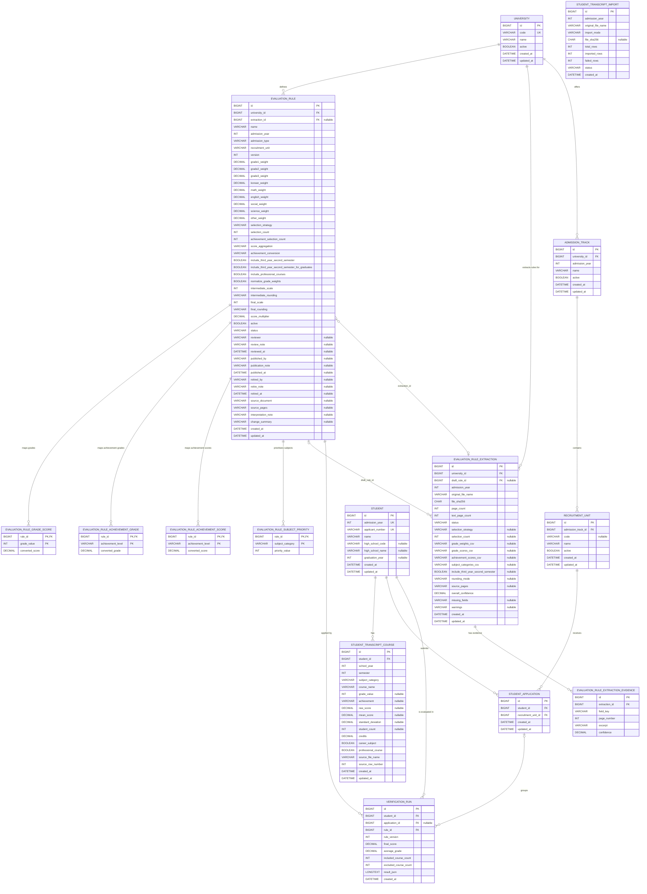

# Grade Validation Database ERD

이 문서는 Flyway 마이그레이션 `V1`~`V11`을 기준으로 작성한 현재 MySQL 스키마의 ERD이다.

## 핵심 제약조건

- `evaluation_rule`은 `(university_id, admission_year, admission_type, recruitment_unit, version)` 조합으로 버전을 유일하게 관리한다.
- `evaluation_rule_extraction`은 `(university_id, admission_year, file_sha256)` 조합으로 같은 모집요강 파일의 중복 추출을 방지한다.
- `student`는 `(admission_year, applicant_number)` 조합이 유일하다.
- `student_transcript_course`는 학생·학년·학기·교과군·과목명 조합이 유일하다.
- `student_application`은 학생과 모집단위 조합이 유일하다.
- `student_transcript_import`는 다른 테이블과 외래 키로 연결되지 않은 독립적인 가져오기 작업 이력이다.

## 삭제 규칙

- 학생 삭제 시 학생부 과목, 지원 정보, 검증 실행 이력이 함께 삭제된다.
- 평가 규칙 삭제 시 등급/성취도 환산표와 교과 우선순위가 함께 삭제된다.
- 규칙 추출 이력 삭제 시 추출 근거가 함께 삭제된다.
- 지원 정보 삭제 시 검증 실행 이력은 유지되고 `application_id`만 `NULL`로 변경된다.
