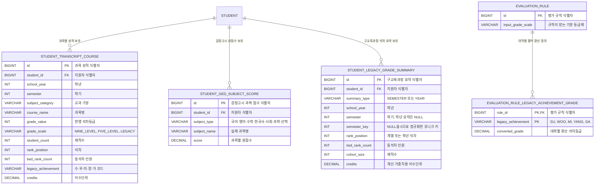

# 구교육과정·검정고시 데이터 모델

Flyway `V20`에서 추가한 공통 학업성적 모델이다. 지원자 원천 데이터와 대학별 환산 규칙을 분리해 같은 원천 성적을 여러 대학 계산에 재사용한다.

## 관계도

## 설계 원칙

- 석차백분율은 원천 데이터에 저장하지 않고 `석차`, `동석차 인원`, `재적수`로 매번 계산해 중간값과 산식 검증이 가능하게 한다.
- 검정고시는 평균만 저장하지 않고 과목별 원점수를 저장한다. 대학별 과목 선택과 단위 가중치는 계산 정책이 담당한다.
- 과목 단위 자료가 없는 오래된 교육과정은 학기 또는 학년 석차를 `student_legacy_grade_summary`에 저장한다.
- 수·우·미·양·가 환산표는 지원자 데이터가 아니라 `evaluation_rule` 하위 테이블에 두어 대학과 규칙 버전별로 변경할 수 있다.
- 5등급제 입력은 모델에서 구분한다. 5등급제 산식이 확정된 규칙만 `input_grade_scale=FIVE_LEVEL`로 게시해야 한다.
